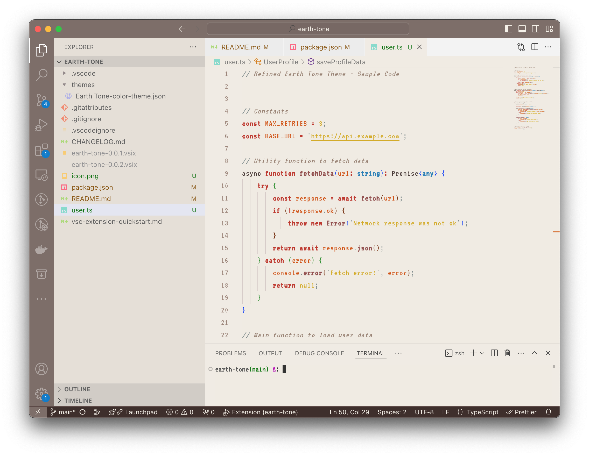
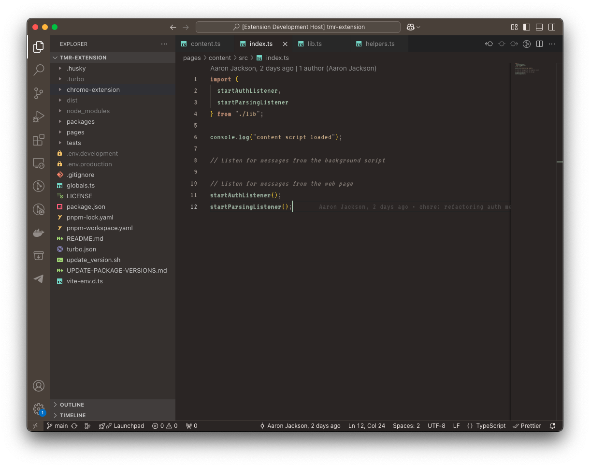

# Earth Tone 🌍
Author: https://github.com/aarontjdev

Welcome to the Earth Tone Theme for VS Code! This theme brings a calm, grounded feel to your coding environment with a balanced palette of earthy neutrals, rich browns, and subtle pastels for syntax highlighting. Designed to reduce eye strain and maintain readability, this theme is ideal for those who prefer a light, refined color scheme.

## 🌿 Features

- **Soft, Earthy Backgrounds**: A neutral background paired with warm accents that are gentle on the eyes.
- **Rich, Warm Highlights**: Shades of terracotta, burnt orange, gold, and blue for syntax highlighting.
- **Readable Contrast**: Improved readability with dark brown text and carefully chosen accent colors.
- **Consistent Styling**: Ensures a cohesive look across languages like JavaScript, TypeScript, Python, HTML, CSS, and more.

## 📸 Screenshots

### Editor View

#### Light Mode

#### Dark Mode

## 🎨 Color Palette

| Element                        | Color Hex | Description                                          |
|--------------------------------|-----------|------------------------------------------------------|
| Background                     | `#F0EBE3` | Soft, light neutral background                       |
| Foreground (Text)              | `#4A3B38` | Rich, dark brown for primary text                    |
| Line Numbers                   | `#9C8579` | Muted taupe for line numbers                         |
| Activity Bar                   | `#7D6E68` | Soft brown for the activity bar                      |
| Sidebar                        | `#E5DFD6` | Warm light beige for the sidebar                     |
| Status Bar                     | `#3E2F2C` | Deep brown for the status bar                        |
| Status Bar Text                | `#F5F1E8` | Soft cream for text in the status bar                |
| Cursor                         | `#D35400` | Burnt orange for the cursor                          |
| Selection Background           | `#D7CCC8` | Soft beige for selection highlight                   |
| Inactive Selection Background  | `#E5DFD6` | Light beige for inactive selection                   |
| Indent Guide                   | `#D7CCC8` | Soft gray indent guides                              |
| Active Indent Guide            | `#B0A49A` | Slightly darker for active indent guides             |

### Syntax Colors

| Token Type             | Color Hex | Description                                           |
|------------------------|-----------|-------------------------------------------------------|
| Comments               | `#998374` | Muted brown for comments, italicized for readability  |
| Keywords               | `#C0392B` | Rich terracotta for keywords, bold for emphasis       |
| Strings & Constants    | `#D4AC0D` | Deep gold for strings and constants                   |
| Variables & Parameters | `#D35400` | Burnt orange for variables and parameters             |
| Functions              | `#955251` | Forest green for functions, bold for definition       |
| Types & Classes        | `#2980B9` | Steel blue for types and classes, bold for clarity    |
| Punctuation            | `#7F8C8D` | Subtle gray for punctuation                           |

## 📦 Installation

1. Open Visual Studio Code.
2. Go to the **Extensions** view by clicking on the square icon in the sidebar or pressing `Ctrl+Shift+X`.
3. Search for **Earth-Tone**.
4. Click **Install** to add the theme.
5. Go to **Preferences > Color Theme** and select **Earth Tone** from the list.
